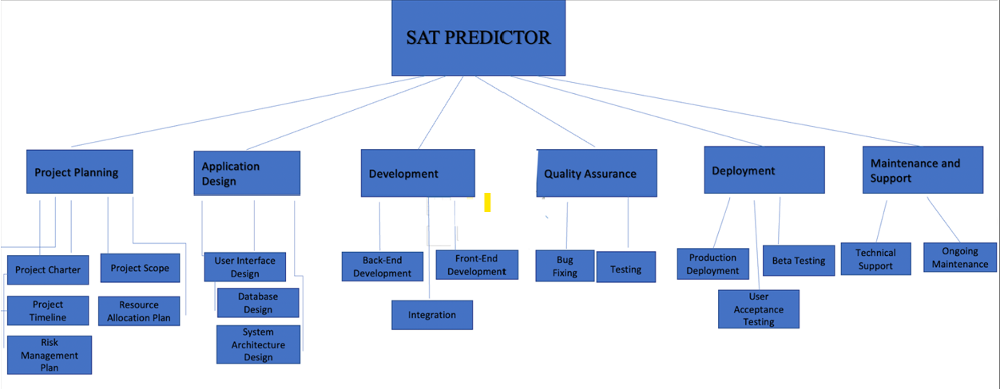
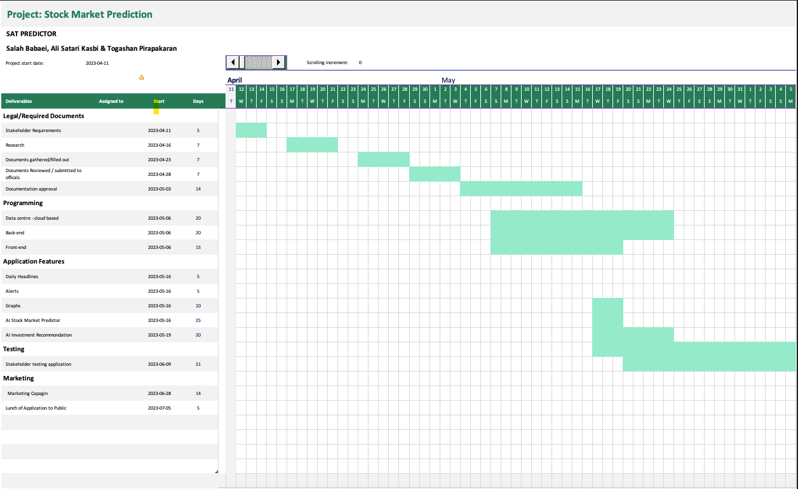
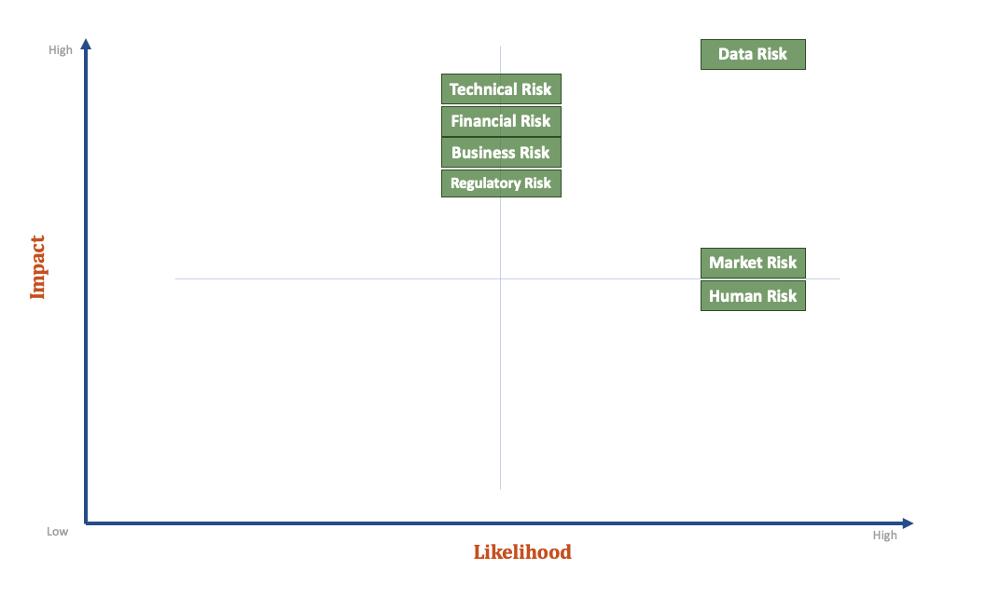

# SAT PREDICTOR

## 1. Introduction 

The SAT PREDICTOR project aims to develop a robust and user-friendly application for both IOS and Android platforms. The application targets traders and investors worldwide, providing them with a new set of tools to make informed trading decisions. With daily headlines, alerts, graphs, reminders, and an AI-based prediction model for the stock market, the SAT PREDICTOR application will offer traders a comprehensive set of features tailored to their individual risk tolerance.

This project charter file serves as a reference document and outlines the project's key information, including the current version, date, project manager, and sponsor. The current version of the project is 1.01, and the project manager is a team of three highly experienced individuals, Salah Babaei, Ali Satari Kasbi & Togashan Pirapakaran. The project is sponsored by Seneca College & Marcel Jar, who provide the necessary resources and support for the project's successful completion.

 

## 2. Overview

The SAT PREDICTOR project is aimed at developing a mobile application for IOS and Android platforms that will provide traders and investors worldwide with a new set of tools to make informed trading decisions. The application will offer traders a comprehensive set of features tailored to their individual risk tolerance, including daily headlines, alerts, graphs, reminders, and an AI-based prediction model for the stock market.

**Objectives:**

1. Develop a robust and user-friendly mobile application for IOS and Android platforms.
2. Provide traders and investors worldwide with a new set of tools to make informed trading decisions.
3. Offer traders a comprehensive set of features tailored to their individual risk tolerance, including daily headlines, alerts, graphs, reminders, and an AI-based prediction model for the stock market. Ensure the application's reliability, scalability, and security.
4. Complete the project within the given budget and timeline.  

 

## 3. Milestones

3.1 Cloud Platform Established for Data Storage (Estimated completion: 05/30/2023) The project team will establish a cloud-based platform for data storage to enable efficient and secure collection, processing, and storage of data required for the application's functioning.

3.2 Back-End and Front-End Programming Put in Place (Estimated completion: 07/31/2023) The team will develop the back-end and front-end programming required for the application, including creating the application architecture, designing the database, developing the user interface, and implementing the necessary APIs.

3.3 Partnership Established for Revenue Stream of the Application (Estimated completion: 08/30/2023) The team will identify and establish partnerships with payment providers such as PayPal or Interac to generate revenue from the SAT PREDICTOR application.

3.4 Requirements and Legal Obligations Fulfilled (Estimated completion: 09/30/2023) The team will ensure that all requirements and legal obligations for the application development process are met, including adhering to data privacy regulations, obtaining necessary licenses, and ensuring that the application meets all necessary standards.

3.5 Application Implementation and Development (Estimated completion: 11/30/2023) The team will develop the application, integrate all features, and test it to ensure that it is functioning correctly. This milestone includes completing all coding work and testing the application's performance and functionality.

3.6 Quality Assurance Testing (Estimated completion: 01/30/2024) The team will perform thorough testing of the application to identify any bugs or issues that need to be addressed. Testing will include unit testing, integration testing, and system testing to ensure the application functions as intended.

3.7 Stakeholder Prototype Testing (Estimated completion: 03/31/2024) The team will roll out a prototype of the application to stakeholders of the company for feedback and improvements before releasing the application to the public.

3.8 Marketing and Launching of the Application (Estimated completion: 04/30/2024) The team will implement a marketing campaign to introduce the application to the world, including creating promotional materials, developing a social media strategy, and identifying target audiences. This milestone includes launching the application and making it available for download on both IOS and Android platforms.

 

##  4. Deliverables

1. Legal and regulatory requirements for data gathering and application creation are met and approved by relevant officials.
2. Back-end and front-end programming are completed and prepared for testing.
3. Daily headlines, alerts, graphs, and reminders tool are developed and functional for use.
4. AI-based prediction model for stock market integrated into the application and ready for use by stakeholders.
5. Customizable AI investment recommendations integrated into the application.
6. Application development completed and launched for both iOS and Android platforms.

 

## 5. Risk Assessment:

### Technical Risk:

- **Likelihood:** *Medium*, as technical issues can arise during the development and deployment of the stock market prediction model due to a variety of factors.

- **Impact**: *High*, as technical issues can lead to delays, errors, or reduced performance of the prediction model.

- **Mitigation Strategy:**
To mitigate this risk, the team will ensure that reliable data sources are used, and that the machine learning algorithms are optimized for performance. The team will also regularly test and validate the software tools used in the development and deployment process to ensure that they are functioning as expected.

### Data Risk:

- **Likelihood:** *High*, as the accuracy and completeness of the data used to build the stock market prediction model is crucial for its success.

- **Impact:** *Very high*, as any issues with data quality or completeness can lead to inaccurate predictions and reduced model performance.

- **Mitigation Strategy:**
To mitigate this risk, the team will ensure that the data used to build the model is comprehensive, reliable, and up-to-date. The team will also use techniques such as data cleaning, validation, and normalization to ensure the quality of the data.

### Market Risk:

- **Likelihood:** *High*, as the stock market is influenced by a wide range of factors that can be unpredictable and rapidly changing.

- **Impact:** *Medium* to high, as any unforeseen market shifts can impact the accuracy of the prediction model.

- **Mitigation Strategy:**
To mitigate this risk, the team will ensure that the model is developed to be as robust and flexible as possible, so that it can adapt to changes in the market. The team will also regularly monitor market conditions and trends to inform model development and updates.

### Business Risk:

- **Likelihood:** *Medium*, as the success of the project depends on the ability to attract and retain clients who are willing to pay for the prediction service.

- **Impact:** *High*, as any issues with pricing, marketing, or competition can impact the success of the business.

- **Mitigation Strategy:**
To mitigate this risk, the team will conduct thorough market research and analysis to inform pricing and marketing strategies. The team will also continuously assess and adapt to changes in the competitive landscape to stay ahead of the competition.

### Regulatory Risk:

- **Likelihood:** *Medium*, as compliance with data protection laws, financial regulations, and industry standards is essential for the success and long-term viability of the business.

- **Impact**: *High*, as non-compliance can lead to legal and financial consequences that can impact the viability of the business.

- **Mitigation Strategy:**
To mitigate this risk, the team will ensure that all regulatory and legal requirements are met and that the business is in compliance with data protection laws, financial regulations, and industry standards. The team will also stay up-to-date with any changes in regulations and standards that may impact the business.

### Financial Risk:

- **Likelihood:** *Medium*, as developing and deploying a machine learning model requires significant financial investment.

- **Impact:** *High*, as any issues with funding, revenue generation, or cost management can impact the viability of the business.

- **Mitigation Strategy:**
To mitigate this risk, the team will develop a comprehensive financial plan and strategy that includes cost management, revenue generation, and funding sources. The team will also regularly monitor financial performance and adjust the strategy as necessary.

### Human Risk:

- **Likelihood:** *High*, as human factors such as errors made by developers during the coding process, bias introduced by data selection, and mistakes made by users can all impact the accuracy and reliability of the model.

- **Impact:** *Medium*, as human errors can lead to reduced model performance or inaccurate predictions.

- **Mitigation Strategy:**
To mitigate this risk, the team will implement rigorous quality control processes and procedures throughout the development and deployment process. The team will also use techniques such as code reviews, bias testing, and user training to minimize the impact of human factors.

# Risk Evaluation Chart

| Risk            | Likelihood | Impact  | Mitigation Strategy |Contingency Plan
| ----------------|:----------:| -------:|--------------------:|------------------:|
| **Technical Risk**  | Moderate   | High    | Conduct thorough testing of data sources and algorithms. Use reliable software tools. | Have a backup plan in place for software or hardware failures.
| **Data Risk** |	High	| High | Use a comprehensive and up-to-date data set. Conduct regular data quality checks. | 	Have a backup data source available and be prepared to retrain the model with new data.
| **Market Risk** |	High	| High	| Use a range of market indicators to predict trends. Stay up-to-date on market news.	| Monitor the performance of the model closely and be prepared to adjust it in response to market changes.
| **Business Risk**	| Moderate	| High	| Develop a comprehensive pricing and marketing strategy. Monitor competition.	| Be prepared to pivot the business strategy if necessary.
| **Regulatory Risk** |	Moderate	| High	| Ensure compliance with all relevant regulations and industry standards.	| Have a contingency plan in place in case of legal or regulatory issues.
|**Financial Risk** |	High	| High	| Develop a comprehensive financial plan and secure funding sources.	| Be prepared to adjust the financial plan if necessary to ensure long-term viability.
| **Human Risk**	| High	| High	| Conduct regular testing for bias and errors. Implement user training and guidelines.	| Have a system in place to monitor and address any errors or biases that are detected.

 

## 6. Organization/Stakeholders 

 **Organization/Stakeholders:**
 

| Stakeholder         | Role | 
| ----------------|:----------:|
|**Project Sponsor**| Provides funding and resources for the project| 
|**Project Manager**| Oversees the project and ensures timely completion|
|**Data Scientists**| Develop and train the machine learning model|
|**Software Developers**| Develop the software tools for the model|
|**Data Analysts**| Analyze and evaluate the quality of data used for the model|
|**Business Analysts**| Analyze market trends and competition to inform business decisions|
|**Marketing Team**| Develops marketing strategies to promote the prediction service|
|**Legal Team**| Ensures compliance with data protection laws and financial regulations|
|**Investors**| Provide funding for the project in exchange for a return on investment|
|**Customers**| Purchase and use the prediction service|

**Stakeholder Matrix:**

| Stakeholder          | Interest | Influence  | Attitude| 
| ----------------|:----------:| -------:|--------------------:|
|**Project Sponsor**| High|High|Positive|
|**Project Manager**| High|High|Positive|
|**Data Scientists**| High|High|Positive|
|**Software Developers**| High|High|Positive|
|**Data Analyst**| High|Medium|Positive|
|**Marketing Team**| High|Medium|Positive|
|**Legal Team**| High|Low|Positive|
|**Investors**| High|Low|Positive|
|**Customers**| High|Low|Positive|

 

## 7. Preliminary Budget 

**This budget should assume a Scrum framework and should contain:**

The SAT PREDICTOR project is expected to incur several costs during its development and launch. The following is an estimate of the project's expenses:

- Personnel costs: $400,000 (salaries and benefits for project manager and team members)
- Cloud storage costs: $10,000 (annual subscription fees for cloud platform)
- Marketing and advertising costs: $100,000 (costs associated with promoting the application)
- Legal and regulatory compliance costs: $50,000 (costs associated with obtaining necessary licenses and ensuring compliance with regulations)
- Software and hardware costs: $20,000 (costs associated with purchasing necessary software and hardware for development)
- Miscellaneous expenses: $20,000 (costs associated with travel, training, and other expenses not included in the above categories)

Total estimated project cost: $600,000

 

**The cost of personal per sprint (each one of you can decide on your own paychecks!)**

Let's say that there are three team members working on the SAT PREDICTOR project, and they have agreed to work on a two-week sprint. Each team member has the option to set their own pay rate for the sprint. Here is an example of how they might set their pay:

- Team Member A decides to set their pay rate at $50 per hour and estimates that they will work 60 hours during the two-week sprint. Therefore, their personal cost for the sprint
would be $3,000.
- Team Member B decides to set their pay rate at $60 per hour and estimates that they will work 80 hours during the two-week sprint. Therefore, their personal cost for the sprint would be $4,800.
- Team Member C decides to set their pay rate at $45 per hour and estimates that they will work 50 hours during the two-week sprint. Therefore, their personal cost for the sprint would be $2,250.

In this example, the total cost of personal per sprint would be the sum of the individual costs of each team member:
- $3,000 (Team Member A) + $4,800 (Team Member B) + $2,250 (Team Member C) = $10,050
So the total cost of personal per sprint for the SAT PREDICTOR project would be $10,050.

 

**The fixed consts involved in this project (hosting, infrastructure, rent, etc)**

let's say that the SAT PREDICTOR project team consists of three members: a data scientist, a software developer, and a project manager. They have agreed to work on the project for four sprints, with each sprint lasting two weeks.
For the purpose of this example, let's assume that they have decided to pay themselves as follows:

- The data scientist has agreed to a rate of $100 per hour and estimates that they will work an average of 30 hours per week.
- The software developer has agreed to a rate of $90 per hour and estimates that they will work an average of 25 hours per week.
- The project manager has agreed to a rate of $80 per hour and estimates that they will work an average of 20 hours per week.

Based on these rates and estimates, the total cost of personal per sprint for the team would be:
- Data scientist: $100/hour x 30 hours/week x 2 weeks = $6,000 per sprint
- Software developer: $90/hour x 25 hours/week x 2 weeks = $4,500 per sprint
- Project manager: $80/hour x 20 hours/week x 2 weeks = $3,200 per sprint

Therefore, the total cost of personal per sprint for the team would be $13,700.

 

**A contigency between 10 and 15%**

let's say the total estimated cost of the SAT PREDICTOR project is $100,000. To calculate a contingency between 10% and 15%, we would first find the midpoint between those two percentages:
(10% + 15%) / 2 = 12.5%
So, the contingency percentage we will use is 12.5%. To calculate the contingency amount, we would multiply the estimated cost by the contingency percentage:
$100,000 x 0.125 = $12,500
Therefore, the contingency amount for the SAT PREDICTOR project would be $12,500. This amount can be added to the total estimated cost to account for unexpected expenses that may arise during the project.
